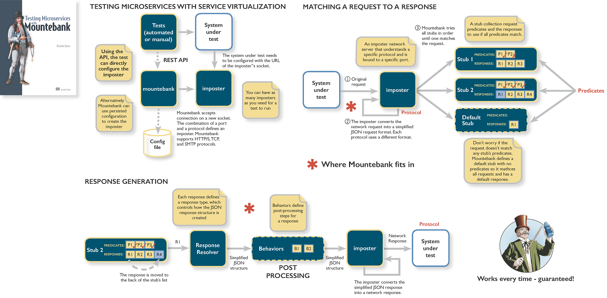

# poc-mountebank

## About:
This repository contains a showcase of the [Mountebank](http://www.mbtest.org/).
```
Mountebank is the first open source tool to provide cross-platform, multi-protocol test doubles over the wire. Simply point your application under test to mountebank instead of the real dependency, and test like you would with traditional stubs and mocks.
```

## Examples:
- Create a Impostor.
- Create a Impostor with another default response.
- Delete a single Impostor.
- Delete all Impostors.
- Create a Stub.
- Create a Stub with Decorator behavior. *(Post-processes the response using JavaScript injection before sending it.)*
- Create a Stub with Wait behavior (constant and range timeouts). *(Adds latency to a response by waiting a specified number of milliseconds before sending the response.)*
- Create a Stub with Copy behavior. *(Copies one or more values from request fields into the response. You can tokenize the response and select values from request fields using regular expressions, xpath, or jsonpath.)*
- Create a Stub with a number of Repeat times. *(The repeat behavior allows certain responses to return a certain number of times before moving on to the next response in the array.)*
- Update a Stub from Impostor.
- Update all Stubs from Impostor.
- Remove a Stub from Impostor.
- Matching a stub by Method and Path.
- Matching a stub by Method, Path and Headers.

## Glossary
- Imposter: A server representing a test double. An imposter is identified by a port and a protocol. Mountebank is non-modal and can create as many imposters as your test requires.
- Stub: A set of configuration used to generate a response for an imposter. An imposter can have 0 or more stubs, each of which are associated with different predicates.
- Predicate: A condition that determines whether a given stub is responsible for responding. Each stub can have 0 or more predicates. (expected request).
- Response: The configuration that generates the response for a stub. Each stub can have 0 or more responses. (response for the expected request).

## Mental Model:
  

## Notes/Links:
[Mountebank CLI](http://www.mbtest.org/docs/commandLine).  
[Mountebank API Contracts](http://www.mbtest.org/docs/api/contracts).  
[Mountebank UI](https://donhenton.github.io/mountebank-UI/public_html/index.html#/): Provide samples of how to add impostors, stubs (match criteria, and responses).  
